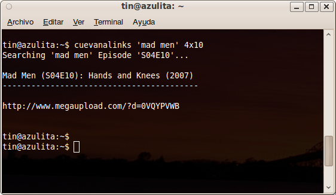

Introduction
************

Cuevana_ is a (pretty cool) site to watch movies and shows in streaming in 
good quality.

CuevanaLinks *scraps* cuevana to download or retrieve links 
and other information to enjoy contents offline. 

Before :ref:`0.2` it worked as a generator of input 
files (with links of file host services) for Tucan_ or JDownloader_ . 

Now CuevanaLinks can do that part also (handling downloads from Megaupload_)
, allowing a complete "cuevana offline" experience. 

.. _Cuevana: http://www.cuevana.tv
.. _Tucan: http://tucaneando.wordpress.com
.. _JDownloader: http://jdownloader.org
.. _Megaupload: http://www.megaupload.com

Screenshot
----------

This is a :abbr:`CLI (Command Line Interface)` program (for now), 
so there is no much eyecandy. But ...  

    
   CuevanaLinks retrieving links of a 'Mad Men' episode

Get and install
***************

Windows 
-------

There are Windows installers (for 32bits) in 
https://bitbucket.org/tin_nqn/cuevanalinks/downloads

Linux and others
----------------

You can install CuevanaLinks via pip_ ::

    $ sudo pip install cuevanalinks

Or via easy_install_ ::

    $ sudo easy_install cuevanalinks

Or directly download the package_ from pypi, and run ::

    $ tar xvfz CuevanaLinks-X.Y.Z.tar.gz
    $ cd CuevanaLinks-X.Y.Z
    $ sudo python setup.py install

*where X.Y.Z is the version you retrieve (hopelly the last and better one)*

Usage
*****

.. note ::

   CuevanaLinks is command line program. If you are a **Windows user** need to 
   open a console, for example 
   :menuselection:`Start Menu --> Run..` and type ``cmd``. 
   Then you should be able to invoke ``cuevanalinks`` command [1]_ 

Get help
--------

You can get help on usage with the flag :option:`-h` ::

    $ cuevanalinks -h
    usage: cuevanalinks [-h] [-s] [-d] [-p] [-l {es, en, pt}] [-r None]
                    title [episode] [end]

    CuevanaLinks 0.4.2 - 2011 Martin Gaitán
    A program to retrieve movies and series (or links to them) from cuevana.tv

    positional arguments:
      title                 Look for a movie or show with this title or URL. If
                            it's not an URL and `episode` is empty a movie is
                            assummed
      episode               Specifies a season/episode of a show. Examples: S01 (a
                            whole season), s02e04, 1x4 If `end` is given retrieve
                            the slices including limits
      end                   Specifies the end of season/episode slices (including
                            it). Examples: S01 (a whole season), s02e04, 1x4

    optional arguments:
      -h, --help            show this help message and exit
      -s, --subs            Download subtitles (if available)
      -d, --download        Download the contents instead show links
      -p, --play            Play while download. This automatically buffer enough
                            data before call the player. It's possible define the
                            player command in the config file
      -l {es, en, pt}, --language {es, en, pt}
                            Define the language of subtitles. Default: 'es'
      -r None, --max_rate None
                            Max File transfer rate (in kbps)

Examples
---------

- Download 'Black Swan'::

    $ cuevanalinks -d 'black swan'

- Retrieve URLs of one specific episode of a show::
    
    $ cuevanalinks house 4x10 

- Download the complete 4th season of *Mad Men* and its subtitles (in spanish)::

    $ cuevanalinks -d -s 'mad men' s04 

  Note that you can also handle downloads through Tucan ::

    $ cuevanalinks -s 'mad men' s04 > links.txt && tucan -d -i links.txt 

- Download a content by its full url::

    $ cuevanalinks -d http://www.cuevana.tv/peliculas/3754/le-concert/	

- Retrieve links of 'Seinfeld' between s02e10 and the last one of 4th season 
  limiting the filetransfer rate to 30kbps ::

    $ cuevanalinks -r 30 seinfeld s02e12 s04 

- Retrieve URLs of *El secreto de sus ojos* (*The Secret in Their Eyes*) and
  download subtitles in english::

    $ cuevanalinks 'secreto de sus ojos' -s -l en

  .. note:: 
        
     Due cuevana.tv is an Argentina based website, there is no many subtitles
     in other languages than spanish

.. _config:

The configuration file
-----------------------

.. versionadded:: 0.3

Cuevanalinks uses a configuration file named :file:`.cuevanalinks/config.ini` in 
your home directory (:file:`/home/youruser/.cuevanalinks/config.ini` in Unix like 
systems).

By defaults it looks like this::

   [main]
   player = mplayer -fs {file}
   file_format = long

Config options
++++++++++++++

.. envvar:: player 
   
   It's the command when :option:`-p` is used. If the placeholder 
   ``{file}`` is present it's replaced with the filename. If not,
   the filename is appended at the end. 
                                
.. envvar:: file_format

   The  format of the filenames when downloading. Could be 
   ``short`` or ``long`` (see :meth:`Content.filename`)

No other options are used at this stage. 

Last seen episode persistence
------------------------------
.. versionadded:: 0.5

When are following a show, frequently you would want wathc the next episode of
the last one you have seen. If you don't remember which one it was just 
use ``next`` instead the specific episode. 

For example::
 
    $ cuevanalinks -ds 'mad men' next 

Also you could define ``again`` to watch the last one again.

.. _PyQuery: http://pyquery.org/
.. _lxml: http://lxml.de/
.. _plac: http://pypi.python.org/pypi/plac
.. _progressbar: 
.. _pip: http://www.pip-installer.org/
.. _easy_install: http://packages.python.org/distribute/easy_install.html
.. _package: http://pypi.python.org/pypi/CuevanaLinks#downloads

.. [1] The installer automatically adds cuevanlink's installation directory into
       your :envvar:`PATH` enviroment variable. 
